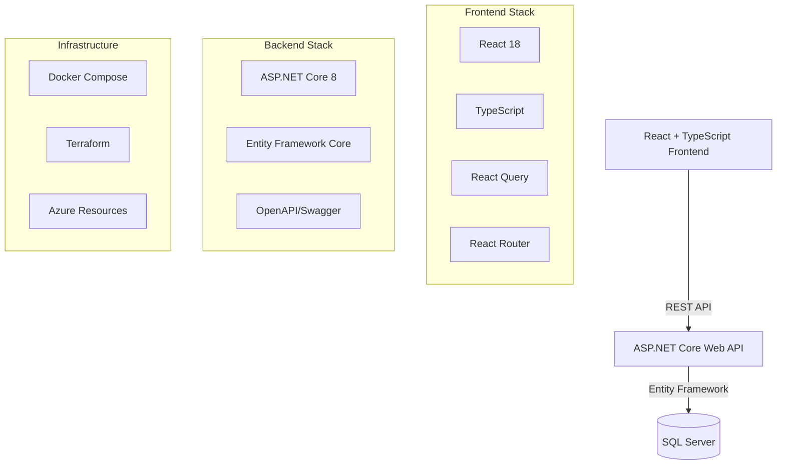

# 💰 BudgetBuddy - GitHub Copilot Showcase Repository

A full-stack budgeting application built to demonstrate GitHub Copilot capabilities across the entire Software Development Lifecycle (SDLC).

[](https://github.com/htekdev/budgeting-app/actions/workflows/ci.yml)
[](https://github.com/htekdev/budgeting-app/actions/workflows/codeql.yml)

## 🎯 What This Repository Showcases

This repository demonstrates how GitHub Copilot enhances developer productivity throughout the entire SDLC:

### 1. **Custom Instructions** (.github/copilot-instructions.md)
- Repository-wide coding conventions and standards
- Build, test, and deployment commands
- Definition of done checklists

### 2. **Path-Scoped Instructions** (.github/instructions/*.instructions.md)
- Context-specific guidance (frontend, backend, IaC, SQL)
- Automatic activation based on file location
- YAML frontmatter with applyTo glob patterns

### 3. **Agent Instructions** (AGENTS.md)
- Guidelines for AI agents working in the repository
- Validation commands and quality gates
- Agent handoff patterns

### 4. **Custom Agents** (.github/agents/*.agent.md)
- Planner: Breaks down tasks and creates implementation plans
- Implementer: Executes code changes following patterns
- Reviewer: Reviews code for quality and security
- DevOps: Manages infrastructure and deployments
- Data: Handles database design and optimization

### 5. **Agent Skills** (.github/skills/*/SKILL.md)
- Reusable expertise modules (API design, DB migrations, etc.)
- Domain-specific knowledge (budgeting domain)
- Best practices and patterns

### 6. **GitHub Actions CI/CD**
- Automated builds, tests, and security scans
- Terraform validation and planning
- Dependabot for dependency updates

### 7. **Development Environments**
- Docker Compose for local development
- GitHub Codespaces with devcontainer
- Consistent development experience

### 8. **Clean Architecture**
- Domain-driven design
- Layered backend (Domain, Application, Infrastructure, API)
- Modern frontend with TypeScript

## 🏗️ Architecture



### Tech Stack

**Frontend**:
- React 18 with TypeScript
- Vite for build tooling
- React Query for server state
- React Router for navigation
- Axios for API calls

**Backend**:
- ASP.NET Core 8 Web API
- Entity Framework Core (Code-First)
- SQL Server
- Clean Architecture pattern
- xUnit for testing

**Infrastructure**:
- Docker & Docker Compose
- Terraform (Azure)
- GitHub Actions
- GitHub Codespaces

## 🚀 Quick Start

### Prerequisites

- Docker Desktop
- .NET 8 SDK
- Node.js 20+
- (Optional) Azure subscription for deployment

### Local Development with Docker Compose

```bash
# Clone the repository
git clone https://github.com/htekdev/budgeting-app.git
cd budgeting-app

# Start all services
docker-compose up -d

# View logs
docker-compose logs -f

# Access the application
# Frontend: http://localhost:5173
# Backend API: http://localhost:5000
# API Docs: http://localhost:5000/swagger
```

### Local Development (Without Docker)

#### Backend

```bash
cd src/backend

# Restore dependencies
dotnet restore

# Apply database migrations
dotnet ef database update --project BudgetBuddy.Infrastructure --startup-project BudgetBuddy.Api

# Run the API
dotnet run --project BudgetBuddy.Api

# Run tests
dotnet test
```

#### Frontend

```bash
cd src/frontend

# Install dependencies
npm install

# Start dev server
npm run dev

# Run linting
npm run lint

# Build for production
npm run build
```

### GitHub Codespaces

1. Click "Code" → "Create codespace on main"
2. Wait for container to build (~3-5 minutes)
3. Codespace automatically:
   - Installs all dependencies
   - Sets up SQL Server
   - Configures development environment
4. Start services:
   ```bash
   # Backend
   cd src/backend && dotnet run --project BudgetBuddy.Api
   
   # Frontend (in new terminal)
   cd src/frontend && npm run dev
   ```

## 📚 Documentation

### Core Documentation

- [Architecture Overview](docs/architecture.md) - System design and patterns
- [Database Documentation](db/README.md) - Schema and migrations
- [Terraform Documentation](infra/terraform/README.md) - Infrastructure as Code

### Runbooks

- [Local Development](docs/runbooks/local-dev.md) - Setting up local environment
- [Database Operations](docs/runbooks/database.md) - Managing the database
- [CI/CD Pipeline](docs/runbooks/ci-cd.md) - Understanding the pipeline
- [Codespaces Setup](docs/runbooks/codespaces.md) - Using GitHub Codespaces
- [User Actions Required](docs/runbooks/user-actions.md) - Manual setup steps
- [Verification Guide](docs/runbooks/verification.md) - Testing the setup

### API Documentation

- OpenAPI/Swagger: http://localhost:5000/swagger (when API is running)
- [API Design Notes](docs/api/openapi-notes.md)

## 🧪 Testing

### Backend Tests

```bash
cd src/backend

# Run all tests
dotnet test

# Run with coverage
dotnet test /p:CollectCoverage=true

# Run specific test category
dotnet test --filter Category=Unit
dotnet test --filter Category=Integration
```

### Frontend Tests

```bash
cd src/frontend

# Run tests (when configured)
npm test

# Run with coverage
npm test -- --coverage
```

## 🔒 Security

- CodeQL analysis runs on every push
- Dependabot monitors dependencies
- No secrets in code (environment variables)
- Input validation on all endpoints
- SQL injection protection via EF Core
- CORS configured appropriately

## 🏗️ Project Structure

```
budgeting-app/
├── .devcontainer/           # Codespaces configuration
├── .github/
│   ├── workflows/           # CI/CD pipelines
│   ├── instructions/        # Path-scoped Copilot instructions
│   ├── agents/              # Custom agent definitions
│   └── skills/              # Reusable agent skills
├── src/
│   ├── frontend/            # React + TypeScript app
│   └── backend/             # ASP.NET Core API
│       ├── BudgetBuddy.Domain/
│       ├── BudgetBuddy.Application/
│       ├── BudgetBuddy.Infrastructure/
│       ├── BudgetBuddy.Api/
│       └── BudgetBuddy.Tests/
├── db/
│   ├── schema/              # SQL schema scripts
│   └── migrations/          # EF Core migrations
├── infra/terraform/         # Infrastructure as Code
├── docs/                    # Documentation
├── AGENTS.md                # Agent behavior guidelines
├── docker-compose.yml       # Local development setup
└── README.md                # This file
```

## 🤝 Contributing

See [CONTRIBUTING.md](CONTRIBUTING.md) for contribution guidelines (to be created).

## 📋 API Endpoints

### Accounts
- `GET /api/v1/accounts` - List all accounts
- `GET /api/v1/accounts/{id}` - Get account by ID
- `POST /api/v1/accounts` - Create account
- `PUT /api/v1/accounts/{id}` - Update account
- `DELETE /api/v1/accounts/{id}` - Delete account (soft)

### Additional endpoints for Categories, Transactions, Budgets, Goals, and Reports are defined in the controllers (to be implemented).

## 🎨 Features

### Implemented
- ✅ Account management
- ✅ Category management
- ✅ Transaction tracking
- ✅ Monthly budgets
- ✅ Recurring transactions
- ✅ Savings goals
- ✅ Audit trail
- ✅ Dashboard with overview
- ✅ Responsive design

### Planned
- ⏳ CSV import/export
- ⏳ Advanced reporting
- ⏳ Budget forecasting
- ⏳ Multi-currency support
- ⏳ Authentication & authorization
- ⏳ Mobile app

## 🛠️ Technologies & Tools

- **Languages**: C# 12, TypeScript, SQL
- **Frameworks**: ASP.NET Core 8, React 18
- **Database**: SQL Server 2022
- **ORM**: Entity Framework Core
- **Testing**: xUnit, FluentAssertions, Moq, Testcontainers
- **Build Tools**: .NET SDK, Vite, npm
- **CI/CD**: GitHub Actions
- **IaC**: Terraform
- **Containerization**: Docker, Docker Compose
- **Code Quality**: ESLint, Prettier, EditorConfig
- **API Documentation**: Swagger/OpenAPI

## 📊 Database Schema

See [Entity Relationship Diagram](docs/diagrams/erd.mmd) for detailed schema.

### Core Tables
- Users
- Accounts
- Categories
- Transactions
- Budgets
- RecurringTransactions
- Goals
- AuditEvents

## 🌟 GitHub Copilot Tips

When working in this repository:

1. **Use context**: Reference `.github/copilot-instructions.md` for standards
2. **Path-scoped help**: Copilot automatically applies relevant instructions based on file location
3. **Agent delegation**: Use custom agents for complex tasks
4. **Skills reference**: Leverage skills for specialized guidance
5. **Follow AGENTS.md**: Validation commands and quality gates

Example prompts:
- "Follow repository custom instructions to add a new API endpoint for..."
- "Using the api-design skill, create a RESTful endpoint for..."
- "Following backend instructions, implement a service that..."

## 📝 License

MIT License - see [LICENSE](LICENSE) file for details

## 🙏 Acknowledgments

Built to showcase GitHub Copilot capabilities including:
- Custom instructions
- Path-scoped instructions
- Agent instructions
- Custom agents
- Agent skills
- CI/CD integration
- Clean architecture
- Modern development practices

---

**Note**: This is a demonstration repository. For production use, additional security, authentication, and error handling would be required.
