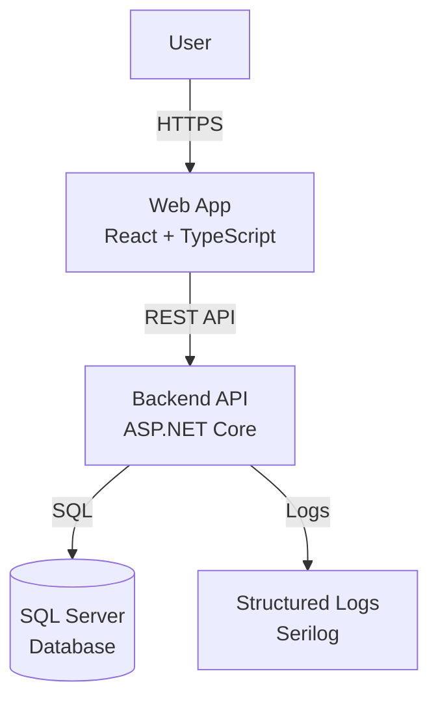
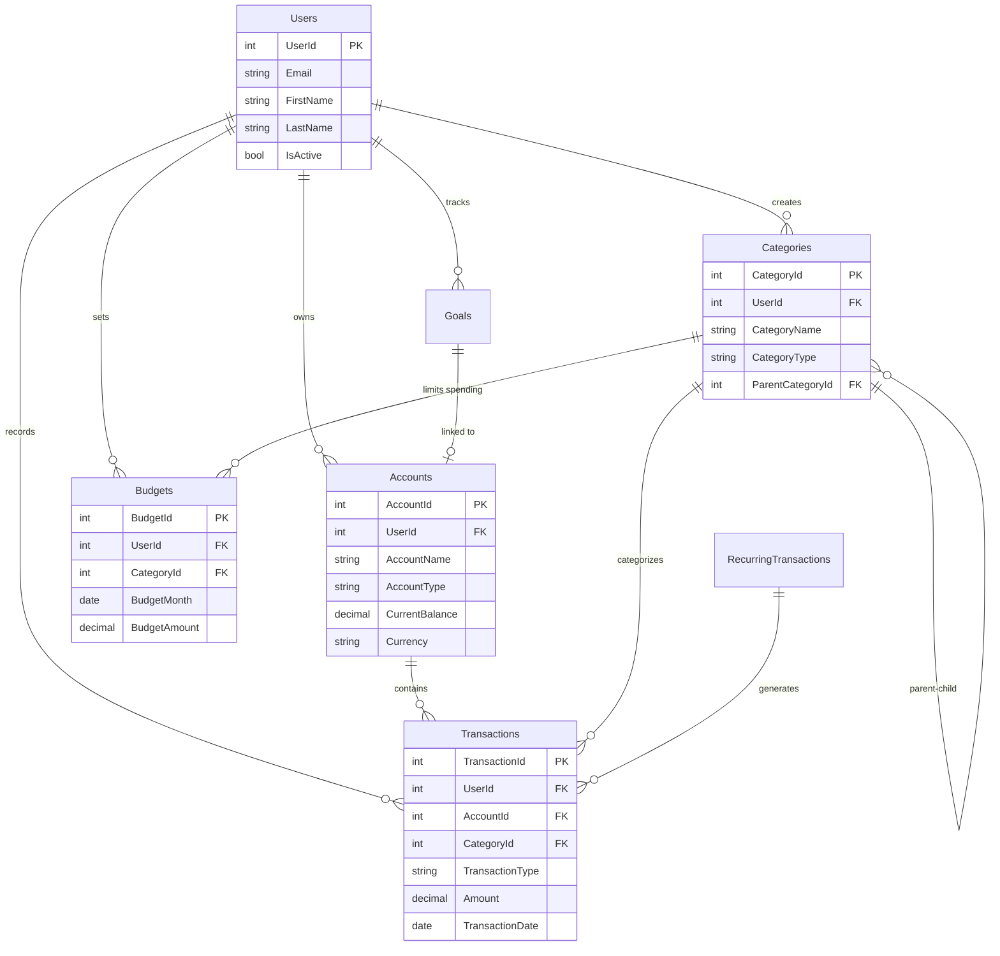

# BudgetBuddy 💰

A comprehensive full-stack budgeting and cashflow management application that demonstrates **GitHub Copilot capabilities across the entire Software Development Lifecycle (SDLC)**.

[](https://github.com/htekdev/budgeting-app/actions/workflows/ci.yml)
[](LICENSE)

## 🎯 What This Repository Demonstrates

This is not just a budgeting app—it's a **showcase of modern software development practices** powered by GitHub Copilot:

- ✅ **Coding**: Clean Architecture with C# backend and TypeScript React frontend
- ✅ **Testing**: Unit tests, integration tests with Testcontainers
- ✅ **Database Design**: SQL Server schema with EF Core migrations
- ✅ **Infrastructure as Code**: Terraform for Azure deployments
- ✅ **CI/CD**: GitHub Actions workflows for build, test, deploy
- ✅ **Documentation**: Comprehensive docs, ADRs, runbooks, and diagrams
- ✅ **Copilot Customization**: Custom instructions, agents, and skills
- ✅ **Observability**: Structured logging, health checks
- ✅ **Security**: Input validation, secret handling, CodeQL scanning
- ✅ **Developer Experience**: Docker Compose for local dev

## 🏗️ Architecture

### Technology Stack

**Frontend**:
- React 18 + TypeScript
- Vite for blazing-fast builds
- React Query for server state
- Recharts for data visualization
- Lucide React for icons

**Backend**:
- ASP.NET Core Web API (.NET 8)
- Entity Framework Core
- SQL Server
- Serilog for structured logging
- FluentValidation
- Swagger/OpenAPI

**Infrastructure**:
- Docker & Docker Compose
- Terraform (Azure)
- GitHub Actions CI/CD

### System Context



### Application Architecture

```
┌─────────────────────────────────────────────────────────────┐
│                         Presentation                         │
│  ┌──────────────────┐           ┌─────────────────────────┐ │
│  │   React Frontend │           │   ASP.NET Core API      │ │
│  │   (TypeScript)   │  ◄─────►  │   (Controllers)         │ │
│  └──────────────────┘           └─────────────────────────┘ │
└────────────────────────────────────┬────────────────────────┘
                                     │
┌────────────────────────────────────▼────────────────────────┐
│                      Application Layer                       │
│  ┌──────────────┐  ┌──────────────┐  ┌──────────────────┐  │
│  │   Commands   │  │   Queries    │  │   DTOs/Models    │  │
│  └──────────────┘  └──────────────┘  └──────────────────┘  │
└────────────────────────────────────┬────────────────────────┘
                                     │
┌────────────────────────────────────▼────────────────────────┐
│                        Domain Layer                          │
│  ┌──────────────────────────────────────────────────────┐   │
│  │  Entities: User, Account, Category, Transaction,     │   │
│  │  Budget, RecurringTransaction, Goal, AuditEvent      │   │
│  └──────────────────────────────────────────────────────┘   │
└────────────────────────────────────┬────────────────────────┘
                                     │
┌────────────────────────────────────▼────────────────────────┐
│                    Infrastructure Layer                      │
│  ┌──────────────────┐        ┌──────────────────────────┐   │
│  │  EF Core         │        │   External Services      │   │
│  │  DbContext       │        │                          │   │
│  └──────────────────┘        └──────────────────────────┘   │
│            │                                                 │
│            ▼                                                 │
│    ┌─────────────┐                                          │
│    │ SQL Server  │                                          │
│    └─────────────┘                                          │
└─────────────────────────────────────────────────────────────┘
```

### Entity Relationship Diagram



## 🚀 Quick Start

### Prerequisites

- **Docker** and **Docker Compose** (easiest way to get started)
- OR:
  - .NET 8 SDK
  - Node.js 20+
  - SQL Server (or use Docker for just the DB)

### Option 1: Docker Compose (Recommended)

Start the entire application with one command:

```bash
# Clone the repository
git clone https://github.com/htekdev/budgeting-app.git
cd budgeting-app

# Start all services (frontend, backend, database)
docker compose up

# Wait for services to start, then access:
# - Frontend: http://localhost:3000
# - Backend API: http://localhost:5000
# - Swagger UI: http://localhost:5000/swagger
```

### Option 2: Local Development

**1. Start SQL Server:**
```bash
docker compose up sqlserver
```

**2. Run Backend:**
```bash
cd src/backend
dotnet restore
dotnet build
dotnet run --project BudgetBuddy.Api
```

Backend will be available at http://localhost:5000

**3. Run Frontend:**
```bash
cd src/frontend
npm install
npm run dev
```

Frontend will be available at http://localhost:5173

### Default Credentials

The application uses a demo user in development mode:
- **Email**: demo@budgetbuddy.local
- **User ID**: 1 (used in API requests)

## 📁 Repository Structure

```
budgeting-app/
├── src/
│   ├── backend/              # ASP.NET Core Web API
│   │   ├── BudgetBuddy.Api/           # REST API controllers
│   │   ├── BudgetBuddy.Application/   # Business logic, DTOs
│   │   ├── BudgetBuddy.Domain/        # Domain entities
│   │   ├── BudgetBuddy.Infrastructure/# EF Core, database
│   │   └── BudgetBuddy.Tests/         # Unit & integration tests
│   └── frontend/             # React + TypeScript + Vite
│       ├── src/
│       ├── tests/
│       └── Dockerfile
├── db/
│   ├── schema/               # SQL schema scripts
│   │   ├── 001_create_tables.sql
│   │   ├── 002_indexes.sql
│   │   └── 003_seed_data.sql
│   └── migrations/           # EF Core migrations
├── infra/
│   └── terraform/            # Infrastructure as Code
│       ├── modules/          # Reusable Terraform modules
│       └── envs/             # Environment configs (dev, prod)
├── docs/
│   ├── architecture.md       # Architecture documentation
│   ├── decisions/            # Architecture Decision Records (ADRs)
│   ├── runbooks/             # Operational guides
│   └── diagrams/             # Mermaid diagrams
├── .github/
│   ├── workflows/            # GitHub Actions CI/CD
│   │   ├── ci.yml
│   │   ├── cd.yml
│   │   ├── terraform.yml
│   │   └── codeql.yml
│   ├── copilot-instructions.md   # Repository-wide Copilot guidance
│   ├── instructions/         # Path-scoped Copilot instructions
│   ├── agents/               # Custom Copilot agents
│   └── skills/               # Reusable Agent Skills
├── AGENTS.md                 # Autonomous coding agent guide
├── docker-compose.yml
└── README.md                 # This file
```

## 🧪 Testing

### Backend Tests

```bash
cd src/backend
dotnet test
```

Test types:
- **Unit tests**: Domain logic, calculations, validation
- **Integration tests**: API endpoints with Testcontainers

### Frontend Tests

```bash
cd src/frontend
npm test              # Run tests
npm run test:coverage # Run with coverage
npm run lint          # Lint TypeScript
```

## 🏗️ Build Commands

### Backend

```bash
cd src/backend
dotnet build               # Build solution
dotnet run                 # Run API
dotnet ef migrations add   # Create migration
dotnet ef database update  # Apply migrations
```

### Frontend

```bash
cd src/frontend
npm install     # Install dependencies
npm run dev     # Dev server with hot reload
npm run build   # Production build
npm run preview # Preview production build
npm run lint    # Lint code
```

## 🚢 Deployment

### Infrastructure (Terraform)

```bash
cd infra/terraform/envs/dev

# Initialize Terraform
terraform init

# Plan changes
terraform plan

# Apply (requires Azure credentials)
terraform apply
```

Resources created:
- Azure Container Apps (frontend & backend)
- Azure SQL Database
- Virtual Network
- Log Analytics Workspace
- Application Insights

### CI/CD Pipeline

The repository includes GitHub Actions workflows:

1. **CI Pipeline** (`.github/workflows/ci.yml`):
   - Builds frontend and backend
   - Runs tests
   - Lints code
   - Uploads artifacts

2. **Terraform Pipeline** (`.github/workflows/terraform.yml`):
   - Validates Terraform
   - Runs `terraform plan` on PRs
   - Applies on merge to main

3. **CD Pipeline** (`.github/workflows/cd.yml`):
   - Deploys to Azure
   - Runs smoke tests

4. **Security Scanning** (`.github/workflows/codeql.yml`):
   - CodeQL analysis
   - Dependency scanning

## 📚 API Documentation

Once the backend is running, visit:
- **Swagger UI**: http://localhost:5000/swagger
- **OpenAPI Spec**: http://localhost:5000/swagger/v1/swagger.json

### Key Endpoints

- `GET /api/v1/accounts` - List accounts
- `POST /api/v1/accounts` - Create account
- `GET /api/v1/transactions` - List transactions
- `POST /api/v1/transactions` - Create transaction
- `GET /api/v1/budgets` - Get budgets
- `GET /api/v1/budgets/summary` - Budget vs actual
- `GET /health` - Health check

## 🤖 GitHub Copilot Customization

This repository showcases advanced GitHub Copilot features:

### Custom Instructions

Path-scoped instructions in `.github/instructions/`:
- `general.instructions.md` - Applies to all files
- `frontend.instructions.md` - TypeScript/React specific
- `backend.instructions.md` - C# specific
- `terraform.instructions.md` - Infrastructure specific
- `sql.instructions.md` - Database specific
- `workflows.instructions.md` - GitHub Actions specific

### Custom Agents

Specialized agents in `.github/agents/`:
- **Planner Agent** - Task breakdown and planning
- **Implementer Agent** - Code implementation
- **Reviewer Agent** - Code review and quality checks
- **DevOps Agent** - CI/CD and infrastructure
- **Data Agent** - Database design and queries

### Agent Skills

Reusable playbooks in `.github/skills/`:
- **api-design** - REST API patterns
- **db-migrations** - Database migration strategies
- **terraform-best-practices** - Infrastructure patterns
- **github-actions-cicd** - CI/CD workflows
- **testing-strategy** - Testing approaches
- **security-review** - Security best practices
- **budgeting-domain** - Domain-specific rules
- **reporting-queries** - Optimized query patterns

See [`.github/copilot-instructions.md`](.github/copilot-instructions.md) for detailed guidance.

## 📖 Documentation

- **Architecture**: [`docs/architecture.md`](docs/architecture.md)
- **Database**: [`db/README.md`](db/README.md)
- **Local Development**: [`docs/runbooks/local-dev.md`](docs/runbooks/local-dev.md)
- **CI/CD**: [`docs/runbooks/ci-cd.md`](docs/runbooks/ci-cd.md)
- **Terraform**: [`infra/terraform/README.md`](infra/terraform/README.md)
- **Autonomous Agents**: [`AGENTS.md`](AGENTS.md)

## 🔐 Security

- ✅ Input validation (client and server)
- ✅ Parameterized queries (EF Core)
- ✅ Secrets management (Azure Key Vault in production)
- ✅ HTTPS enforced
- ✅ SQL injection prevention
- ✅ XSS prevention
- ✅ CodeQL security scanning
- ✅ Dependabot for dependency updates

**Never commit secrets!** Use environment variables and Azure Key Vault.

## 🛠️ Development

### Adding a New Feature

1. **Plan** - Use the Planner Agent to break down the task
2. **Implement** - Follow conventions in `.github/copilot-instructions.md`
3. **Test** - Write unit and integration tests
4. **Document** - Update relevant documentation
5. **Review** - Use the Reviewer Agent for code review
6. **Deploy** - CI/CD pipeline handles deployment

### Coding Conventions

All conventions are documented in:
- [`.github/copilot-instructions.md`](.github/copilot-instructions.md)
- Path-scoped instructions in `.github/instructions/`

Key principles:
- **Backend**: Clean Architecture, async/await, structured logging
- **Frontend**: Functional components, React Query, strict TypeScript
- **Database**: EF Core migrations, never modify existing migrations
- **Infrastructure**: Terraform modules, remote state, no hardcoded secrets

## 🤝 Contributing

This is a demo repository showcasing GitHub Copilot capabilities. Contributions are welcome!

1. Fork the repository
2. Create a feature branch
3. Make your changes
4. Write/update tests
5. Update documentation
6. Submit a pull request

See [`AGENTS.md`](AGENTS.md) for detailed development guidelines.

## 📝 License

This project is licensed under the MIT License - see the [LICENSE](LICENSE) file for details.

## 🙏 Acknowledgments

This repository was built to demonstrate:
- Modern full-stack development practices
- GitHub Copilot capabilities across the SDLC
- Clean Architecture and Domain-Driven Design principles
- Infrastructure as Code with Terraform
- CI/CD with GitHub Actions
- Comprehensive documentation and testing

## 📞 Support

- **Issues**: [GitHub Issues](https://github.com/htekdev/budgeting-app/issues)
- **Documentation**: See [`docs/`](docs/) directory
- **Runbooks**: See [`docs/runbooks/`](docs/runbooks/)

---

**Built with ❤️ and GitHub Copilot**
