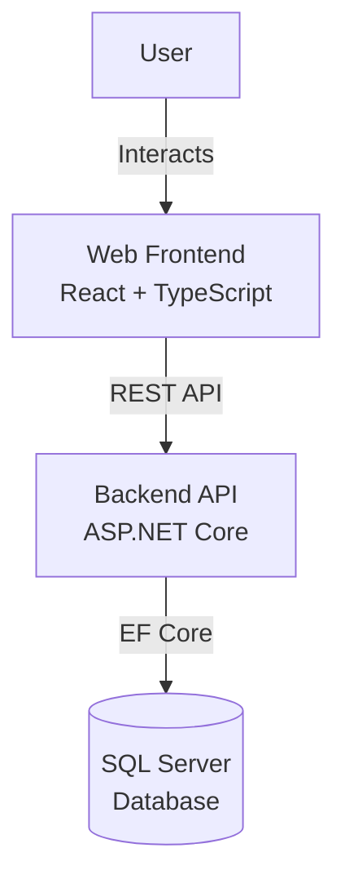

# BudgetBuddy Architecture

## System Context

BudgetBuddy is a modern full-stack budgeting application that helps users track income, expenses, budgets, and financial goals.

### High-Level Architecture



## Architecture Principles

1. **Clean Architecture**: Separation of concerns with distinct layers
2. **Domain-Driven Design**: Business logic in domain layer
3. **API-First**: RESTful API as the primary interface
4. **Modern Frontend**: React with TypeScript for type safety
5. **Infrastructure as Code**: Terraform for reproducible deployments
6. **DevOps**: Automated CI/CD pipelines

## Component Architecture

### Frontend (React + TypeScript)

```
src/frontend/
├── src/
│   ├── api/          # API client layer
│   ├── components/   # Reusable UI components
│   ├── pages/        # Page-level components
│   ├── types/        # TypeScript type definitions
│   └── utils/        # Helper functions
```

**Key Technologies**:
- React 18 (functional components + hooks)
- TypeScript (strict mode)
- React Query (server state management)
- React Router (client-side routing)
- Axios (HTTP client)

### Backend (ASP.NET Core)

**Clean Architecture Layers**:

1. **Domain Layer** (`BudgetBuddy.Domain`)
   - Entities (User, Account, Transaction, etc.)
   - Enums
   - Domain interfaces
   - No external dependencies

2. **Application Layer** (`BudgetBuddy.Application`)
   - Service interfaces
   - DTOs (Data Transfer Objects)
   - Business logic
   - Depends only on Domain

3. **Infrastructure Layer** (`BudgetBuddy.Infrastructure`)
   - DbContext (Entity Framework Core)
   - Repository implementations
   - External service integrations
   - Depends on Domain and Application

4. **API Layer** (`BudgetBuddy.Api`)
   - Controllers (thin, delegate to services)
   - Middleware
   - Dependency injection configuration
   - Depends on all layers

5. **Tests** (`BudgetBuddy.Tests`)
   - Unit tests (business logic)
   - Integration tests (API + database)
   - Uses xUnit, FluentAssertions, Moq, Testcontainers

### Database (SQL Server)

**Schema Design**:
- Normalized relational model
- Foreign key constraints for referential integrity
- Indexes on frequently queried columns
- Audit trail with AuditEvents table

**Key Tables**:
- Users
- Accounts
- Categories
- Transactions
- Budgets
- RecurringTransactions
- Goals
- AuditEvents

**Migration Strategy**:
- Entity Framework Core Code-First migrations
- Version-controlled migration files
- Applied automatically in development
- Controlled deployments in production

## Data Flow

### Read Operation (GET)

```
User → Frontend → API Controller → Service → DbContext → SQL Server
                                           ↓
User ← Frontend ← DTO ← Service ← Entity ← SQL Server
```

### Write Operation (POST/PUT)

```
User → Frontend → API Controller → Service → DbContext → SQL Server
                    ↓                ↓
              Validation       Business Logic
                              Audit Logging
```

## Security Architecture

1. **API Security**:
   - CORS configured for frontend origin
   - Input validation on all endpoints
   - ProblemDetails for error responses
   - (Future) JWT authentication

2. **Database Security**:
   - Parameterized queries via EF Core
   - Connection strings in environment variables
   - Principle of least privilege for database user

3. **Infrastructure Security**:
   - Secrets managed via Azure Key Vault (production)
   - Network security groups
   - Firewall rules for database access

## Deployment Architecture

### Local Development

```
Docker Compose
├── SQL Server (port 1433)
├── Backend API (port 5000)
└── Frontend (port 5173)
```

### Cloud Deployment (Azure)

```
Azure Resource Group
├── Container Apps Environment
│   ├── Backend Container App
│   └── Frontend Container App
├── Azure SQL Database
├── Log Analytics Workspace
└── Application Insights
```

## Quality Attributes

### Performance

- Asynchronous I/O operations (`async/await`)
- Database query optimization with indexes
- React Query caching on frontend
- Pagination for large data sets

### Scalability

- Stateless API (horizontal scaling)
- Database connection pooling
- Container-based deployment
- Separate read/write optimization potential

### Maintainability

- Clean Architecture (testable, swappable layers)
- TypeScript for type safety
- Comprehensive test coverage
- Code documentation
- Consistent coding standards

### Reliability

- Health checks on API
- Retry logic for database connections
- Error handling and logging
- Graceful degradation

## Technology Decisions

See [Architecture Decision Records](decisions/) for detailed rationale behind key technology choices.

### Key ADRs

- [ADR-0001: Overall Architecture](decisions/adr-0001-architecture.md)

## Diagrams

- [System Context Diagram](diagrams/system-context.mmd)
- [Container Diagram](diagrams/container-diagram.mmd)
- [Entity Relationship Diagram](diagrams/erd.mmd)

## Development Workflow

1. **Local Development**: Docker Compose
2. **Feature Development**: Feature branch + PR
3. **CI**: Automated build, test, lint
4. **Code Review**: PR review process
5. **CD**: Deploy to dev environment
6. **Testing**: Integration/acceptance testing
7. **Production**: Deploy to prod environment

## Monitoring & Observability

- Structured logging (Serilog pattern)
- Application Insights for telemetry
- Health check endpoints
- Database query monitoring

## Future Enhancements

- Authentication & Authorization (Auth0/Azure AD)
- Multi-tenancy support
- Caching layer (Redis)
- Message queue for background jobs
- API rate limiting
- GraphQL endpoint option
- Mobile applications
