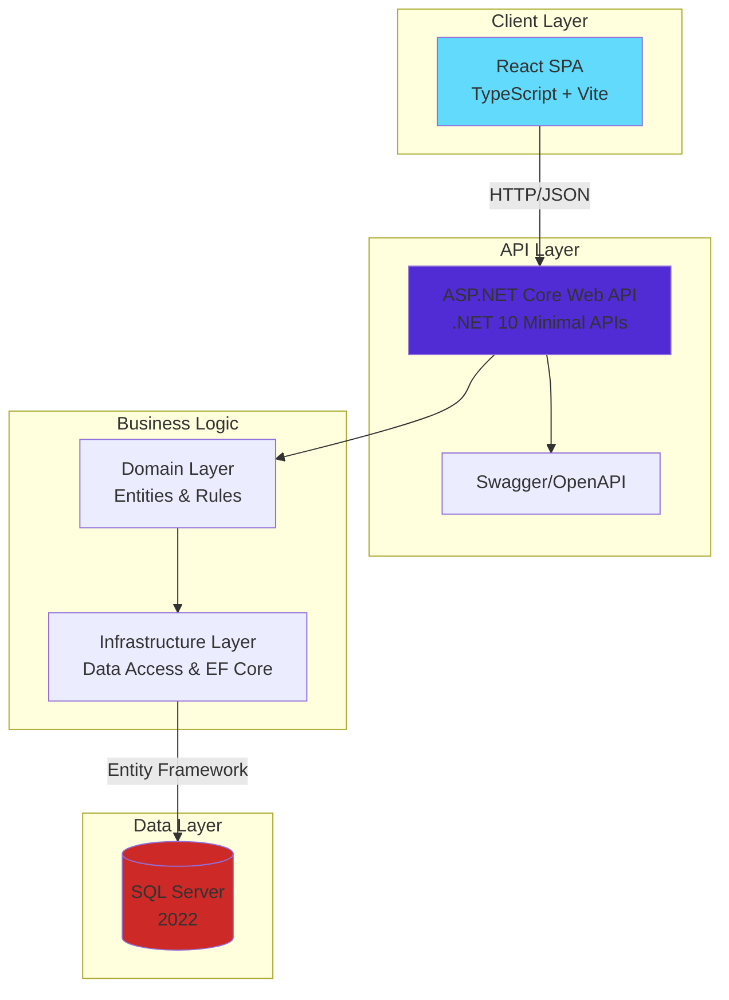
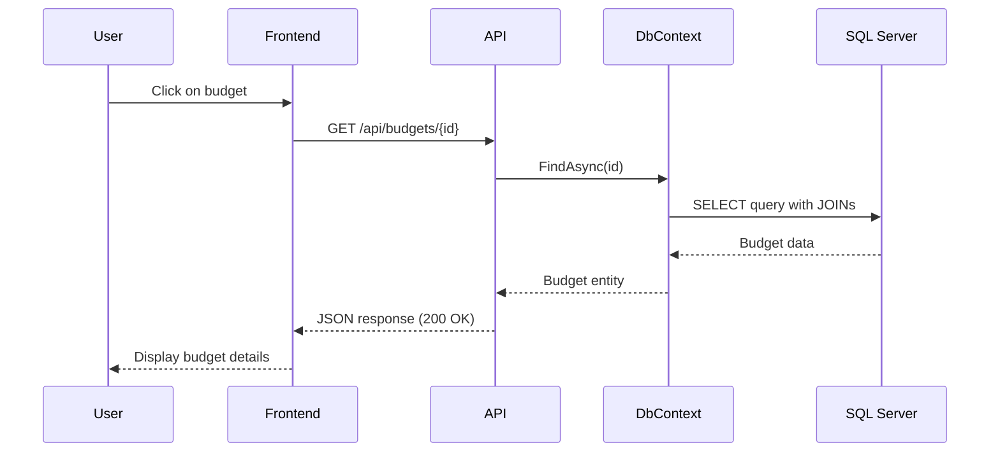
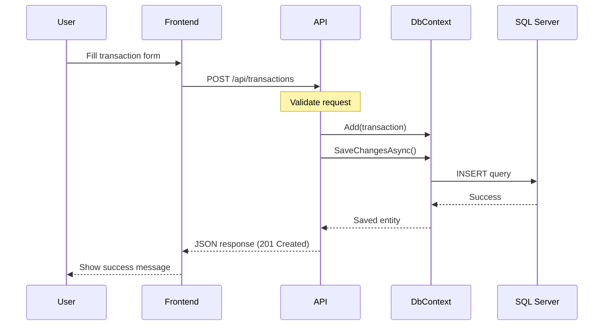
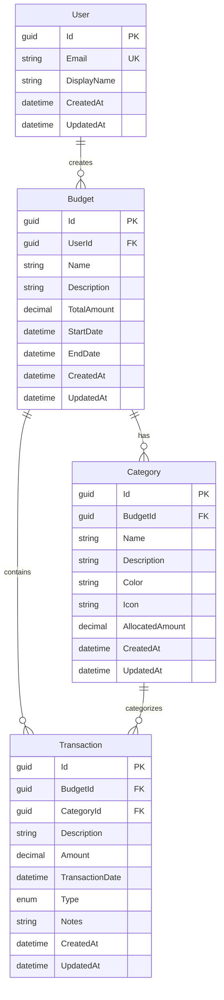
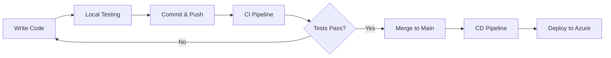

# BudgetBuddy System Design

## Overview
BudgetBuddy is a full-stack personal budgeting application built with modern technologies and best practices. It demonstrates how GitHub Copilot can accelerate development across the entire SDLC.

## High-Level Architecture



## Technology Stack

### Frontend
- **Framework**: React 18+
- **Language**: TypeScript 5+
- **Build Tool**: Vite 7+
- **HTTP Client**: Axios
- **API Client**: Generated from OpenAPI spec using swagger-typescript-api
- **Styling**: CSS Modules
- **State Management**: React Hooks + Context API (future: React Query)

### Backend
- **Framework**: ASP.NET Core 10.0
- **Pattern**: Minimal APIs (not Controllers)
- **Language**: C# 12
- **ORM**: Entity Framework Core 10
- **Logging**: Serilog (structured logging)
- **Validation**: FluentValidation
- **API Documentation**: OpenAPI 3.0 (Swagger)

### Database
- **DBMS**: SQL Server 2022
- **Migrations**: Entity Framework Core Code-First
- **Connection**: ADO.NET via Entity Framework

### Infrastructure
- **Containers**: Docker & Docker Compose
- **IaC**: Terraform (Azure)
- **CI/CD**: GitHub Actions
- **Dev Environment**: GitHub Codespaces with devcontainer

## Architecture Patterns

### Clean Architecture

The backend follows Clean Architecture principles with clear separation of concerns:

```
┌─────────────────────────────────────────────┐
│           BudgetBuddy.API                   │
│  (Presentation - Minimal API Endpoints)     │
└──────────────────┬──────────────────────────┘
                   │
┌──────────────────┴──────────────────────────┐
│      BudgetBuddy.Infrastructure             │
│  (Data Access - DbContext, Repositories)    │
└──────────────────┬──────────────────────────┘
                   │
┌──────────────────┴──────────────────────────┐
│        BudgetBuddy.Domain                   │
│     (Business Logic - Entities, Rules)      │
└─────────────────────────────────────────────┘
```

**Dependency Flow**: API → Infrastructure → Domain
- Domain has no dependencies (pure business logic)
- Infrastructure depends on Domain
- API depends on both Infrastructure and Domain

### API Design Pattern

**RESTful Minimal APIs**:
- Resource-based endpoints (`/api/budgets`, `/api/transactions`)
- HTTP verbs for operations (GET, POST, PUT, DELETE)
- Proper status codes (200, 201, 404, 400, 500)
- Pagination for list endpoints
- HATEOAS principles where applicable

**Example Endpoint**:
```csharp
app.MapGet("/api/budgets/{id:guid}", async (Guid id, BudgetBuddyDbContext db) =>
{
    var budget = await db.Budgets
        .Include(b => b.Categories)
        .Include(b => b.Transactions)
        .FirstOrDefaultAsync(b => b.Id == id);
    
    return budget is not null ? Results.Ok(budget) : Results.NotFound();
})
.WithName("GetBudgetById")
.WithTags("Budgets");
```

## Data Flow

### Read Operation (GET Budget by ID)



### Write Operation (Create Transaction)



## Domain Model



## Component Interactions

### Frontend Components Structure

```
App
├── Router
│   ├── HomePage
│   │   └── BudgetList
│   │       └── BudgetCard
│   ├── BudgetDetailPage
│   │   ├── BudgetSummary
│   │   ├── CategoryList
│   │   │   └── CategoryCard
│   │   └── TransactionList
│   │       └── TransactionRow
│   ├── CreateBudgetPage
│   │   └── BudgetForm
│   └── CreateTransactionPage
│       └── TransactionForm
└── Shared
    ├── Header
    ├── Navigation
    ├── ErrorBoundary
    └── Loading
```

## Security Architecture

### Authentication & Authorization (Future)
- JWT Bearer tokens for API authentication
- Token stored in httpOnly cookie (secure)
- Refresh token rotation
- Azure AD integration for enterprise

### Current Security Measures
1. **HTTPS Only**: Enforced via HTTPS redirection
2. **CORS**: Configured for specific origins
3. **SQL Injection Prevention**: Entity Framework parameterized queries
4. **Input Validation**: FluentValidation on API layer
5. **Secrets Management**: Environment variables, Azure Key Vault in production

## Observability

### Logging
- **Library**: Serilog with structured logging
- **Log Levels**: Debug, Information, Warning, Error, Fatal
- **Output**: Console (dev), Application Insights (production)
- **Correlation**: Request IDs for distributed tracing

### Health Checks
- **Endpoint**: `/health`
- **Checks**: Database connectivity, API responsiveness
- **Integration**: Azure App Service health monitoring

### Monitoring (Production)
- **Application Insights**: Performance metrics, error tracking
- **Log Analytics**: Centralized log aggregation
- **Alerts**: Critical error notifications

## Deployment Architecture

### Development (Local)
```
Docker Compose
├── sqlserver (container)
├── backend (container)
└── frontend (container)
```

### Production (Azure)
```
Azure
├── Resource Group
│   ├── App Service Plan (Linux)
│   ├── App Service (Backend API)
│   ├── App Service (Frontend)
│   ├── SQL Server
│   ├── SQL Database
│   ├── Key Vault (secrets)
│   └── Application Insights
```

## Performance Considerations

### Backend Optimizations
1. **Async/Await**: All I/O operations are asynchronous
2. **Pagination**: List endpoints paginated (default 10, max 100)
3. **Eager Loading**: Use `.Include()` to avoid N+1 queries
4. **Caching**: (Future) Response caching for frequently accessed data
5. **Compression**: Response compression enabled

### Frontend Optimizations
1. **Code Splitting**: Lazy load routes
2. **Bundle Optimization**: Vite's tree-shaking and minification
3. **API Client**: Type-safe, generated from OpenAPI
4. **Memoization**: React.memo for expensive components

### Database Optimizations
1. **Indexes**: On foreign keys and frequently queried columns
2. **Precision**: Decimal(18,2) for monetary values
3. **Cascade Delete**: Configured relationships
4. **Connection Pooling**: Managed by Entity Framework

## Scalability Strategy

### Horizontal Scaling
- Backend API is stateless (can scale out)
- Load balancer distributes requests
- Database connection pooling

### Vertical Scaling
- App Service Plan can be upgraded
- SQL Database can be scaled up/down
- Elastic pools for multiple databases

## Future Enhancements

1. **Authentication**: Implement JWT-based auth with Azure AD
2. **Real-time Updates**: SignalR for live budget updates
3. **Offline Support**: PWA with service workers
4. **Mobile Apps**: React Native or .NET MAUI
5. **Advanced Analytics**: Budget forecasting, spending insights
6. **Multi-currency**: Support for multiple currencies
7. **Shared Budgets**: Collaborative budget management
8. **Recurring Transactions**: Automated transaction creation
9. **File Uploads**: Receipt scanning and attachment
10. **Export/Import**: CSV, Excel data export

## Development Workflow



## Tools & Technologies Summary

| Category | Technology | Purpose |
|----------|------------|---------|
| Frontend Framework | React 18 | UI components |
| Frontend Language | TypeScript 5 | Type safety |
| Frontend Build | Vite 7 | Fast builds |
| Backend Framework | ASP.NET Core 10 | Web API |
| Backend Language | C# 12 | Server logic |
| ORM | Entity Framework Core 10 | Data access |
| Database | SQL Server 2022 | Data storage |
| Logging | Serilog | Structured logging |
| API Docs | Swagger/OpenAPI | API documentation |
| Containers | Docker | Local development |
| IaC | Terraform | Infrastructure |
| CI/CD | GitHub Actions | Automation |
| Cloud | Azure | Hosting |
| Dev Environment | Codespaces | Remote development |

## References

- [ASP.NET Core Best Practices](https://learn.microsoft.com/en-us/aspnet/core/fundamentals/best-practices)
- [React TypeScript Best Practices](https://react-typescript-cheatsheet.netlify.app/)
- [Clean Architecture](https://blog.cleancoder.com/uncle-bob/2012/08/13/the-clean-architecture.html)
- [Entity Framework Core](https://learn.microsoft.com/en-us/ef/core/)
- [Azure Architecture Center](https://learn.microsoft.com/en-us/azure/architecture/)
